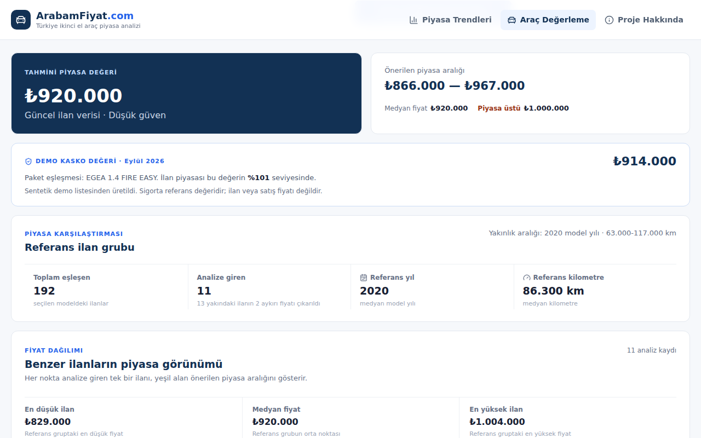
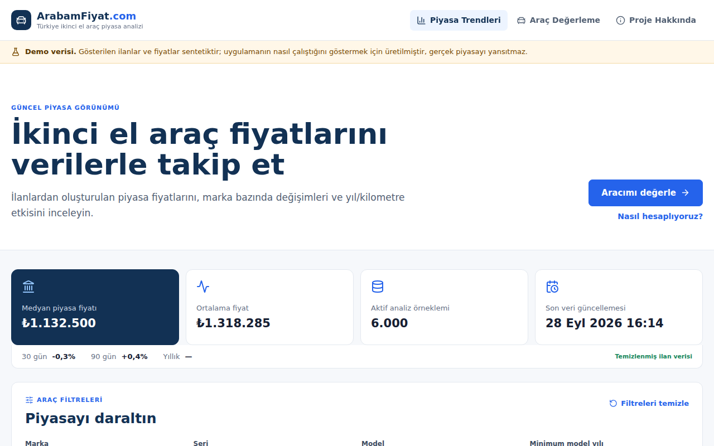
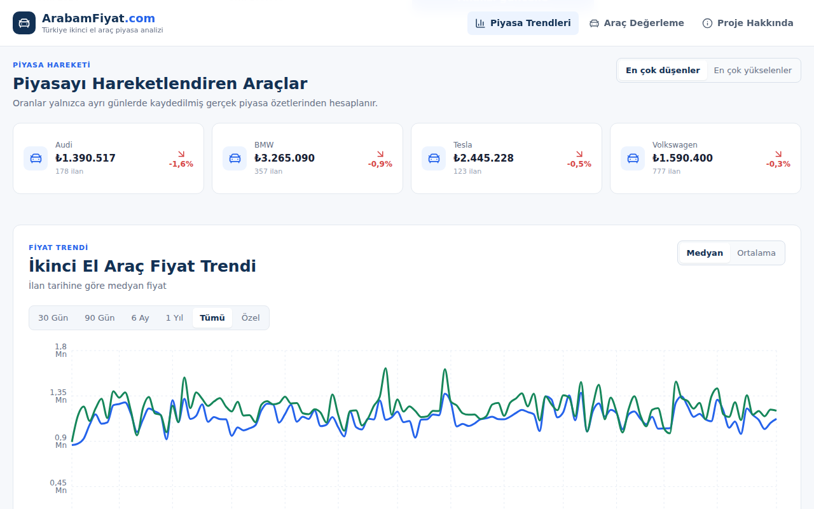

# ArabamFiyat.com

**İkinci el araç için veriye dayalı fiyat karar desteği.** Marka, seri, model, yıl ve kilometreyi girin; uygulama benzer ilanları puanlayıp aracın piyasa değerini, önerilen fiyat aralığını ve TSB kasko değerini gösterir. Piyasa sayfası marka bazında fiyat trendlerini ve değişimleri izler.



> Bu ürün bir ekspertiz ya da kesin satış fiyatı hizmeti değildir. Sonuçlar, mevcut ilan verisinden üretilen karar destek tahminleridir.

[2 dakikalık ürün demosunu YouTube'da izle](https://youtu.be/CIdeayz5XvY)

## Ne yapar

- **Araç değerleme:** Aynı araç grubundaki ilanları yıl, kilometre, paket yakınlığı ve güncelliğe göre puanlar. Aykırı fiyatları ayıklar, ağırlıklı medyan ile piyasa değeri ve fiyat aralığı üretir. İstenen fiyatın piyasanın altında mı üstünde mi olduğunu söyler.
- **Kondisyon etkisi:** Boyalı ve değişen parça sayısının fiyata göreli etkisini bir CatBoost modeliyle tahmin edip piyasa değerine uygular.
- **Kasko referansı:** Aracın TSB kasko değerini ve ilan piyasasının bu değere oranını gösterir. Benzer ilan yoksa tek başına dayanak olur.
- **Piyasa trendleri:** Medyan fiyat trendi, marka karşılaştırma tablosu (30/90 günlük ve yıllık değişimlerle), en çok yükselen ve düşen markalar, yıl/kilometre ile fiyat ilişkisi.
- **Dayanak ilanlar:** Değerlemenin dayandığı ilanlardan araca en çok benzeyen 10 tanesi, gerçek fiyatları ve tahmine göre farklarıyla listelenir.
- **Satış bildirimi:** Kullanıcı aracını gerçekte kaça sattığını paylaşabilir. Bildirimler ilanlardan ayrı bir veritabanında (`sale_reports.sqlite3`) tutulur; aynı araç için en az 3 bildirim birikince değerlemede yalnızca medyanı gösterilir.
- **Karşılaştırma:** İki aracın piyasa değeri, fiyat aralığı, kasko değeri ve kullanıcı satışları tek tabloda, aradaki farkla birlikte gösterilir.
- **Paylaşma:** Her değerlemenin adresi o aracı içerir; bağlantıyı açan kişi aynı sonucu görür. Sonuç tek tıkla PDF olarak kaydedilebilir.
- **Koyu tema:** Sistem ayarını izler; üst menüdeki düğmeyle değiştirilebilir ve tercih hatırlanır.
- **Şeffaflık:** Kaç ilanın eşleştiği, kaçının analize girdiği ve kaç aykırı fiyatın çıkarıldığı her sonuçta yazılır. Yetersiz veride sahte değişim yüzdesi gösterilmez.



## Hızlı başlangıç

İlan verisi gerekmez: veritabanı yoksa uygulama sentetik demo verisiyle açılır ve bunu her sayfada **"Demo verisi"** uyarısıyla belirtir.

### Docker ile (en kolayı)

```bash
docker compose up --build
```

Ardından http://localhost:8080 adresini aç.

### Windows'ta tek tıkla

Kurulumu bir kez yap (Python 3.11+, Node.js 20+ gerekir):

```bat
py -m venv .venv
.venv\Scripts\pip install -r requirements-dev.txt
cd web && npm ci && cd ..
```

Sonra `scripts\start_local.bat` dosyasına çift tıkla. Betik gerekirse demo verisini yükler, API'yi ve web sunucusunu ayrı pencerelerde başlatır ve siteyi tarayıcıda açar.

### Elle (Linux / macOS / Windows)

```bash
python3 -m venv .venv
.venv/bin/pip install -r requirements-dev.txt
(cd web && npm ci)
./scripts/load_demo_data.sh      # veritabanı yoksa
./scripts/run_api.sh             # 1. terminal
./scripts/run_web_app.sh         # 2. terminal
```

| Adres | |
| --- | --- |
| Web | http://127.0.0.1:5173 |
| API | http://127.0.0.1:8000 |
| API dokümantasyonu | http://127.0.0.1:8000/docs |

Her komutun Windows (`scripts\*.bat`) ve POSIX (`scripts/*.sh`) karşılığı vardır.

## Veri kaynakları

Analiz katmanı ilanların nereden geldiğini bilmez. Her kaynak aynı ilan şemasını üretir, aynı ham tabloya yazılır ve aynı temizleme hattından geçer:

```text
kaynak (demo | CSV | ileride partner API)  ->  ham ilan tablosu  ->  temizleme  ->  analiz + API
```

| Kaynak | Komut | Ne zaman |
| --- | --- | --- |
| Demo verisi | `scripts/load_demo_data` | Denemek, sunmak, geliştirmek |
| CSV dosyası | `scripts/import_listings <dosya.csv>` | Kullanım izni olan her veri: partner dışa aktarımı, lisanslı veri seti, elle toplanan ilanlar |
| TSB kasko listesi | `data/reference/kasko/` klasörü | Aylık resmi **sigorta referans değeri**; ilan fiyatıyla karıştırılmaz, ayrı tabloda tutulur |

Yeni bir kaynak eklemek, `ListingSource` arayüzünü (`src/ingestion/sources/base.py`) uygulayan küçük bir sınıf yazmaktır; analiz, API ve arayüz değişmez.

**Demo verisi** 6.000 sentetik ilan ve 14 haftalık piyasa özetinden oluşur. Fiyatlar belgelenmiş basit bir modelle üretilir: yeni araç fiyatı, yıllık değer kaybı, kilometre, kondisyon, aylık değişim ve gürültü. Demo verisi `source = demo` olarak saklanır, gerçek veriyle aynı veritabanına yüklenemez ve arayüzde her zaman etiketlenir.

**CSV ile kendi verini yüklemek:** Başlıklar şemanın sütun adlarıdır. Zorunlu olanlar: `title, brand, series, model, year, mileage_km, price`. İsteğe bağlı olanlardan bazıları: `city, fuel_type, transmission, body_type, listing_date, source_listing_id`. Virgül ya da noktalı virgülle ayrılmış dosyalar ve `1.250.000 TL`, `85.000 km` gibi yazımlar okunur. Örnek dosya: [data/examples/listings_example.csv](data/examples/listings_example.csv).

```bash
./scripts/import_listings.sh data/examples/listings_example.csv --source-name ornek
```

Zorunlu bir sütun eksikse aktarım hiçbir şey yazmadan durur ve dosyada gördüğü başlıkları listeler. Aynı dosyayı tekrar yüklemek kayıtları çoğaltmaz.

**Kasko listesi:** Aylık TSB dosyasını `data/reference/kasko/` klasörüne bırakmak yeterli; günlük bakım hattı yeni dönemi içeri aktarır. Ayrıntılar: [data/reference/kasko/README.md](data/reference/kasko/README.md).

**Deneysel scraper:** Projenin ilk sürümünde ilanlar sahibinden.com'dan tarayıcıyla toplanıyordu. Bu kod [src/experimental/sahibinden/](src/experimental/sahibinden/README.md) altında araştırma prototipi olarak duruyor. Ürün ona bağlı değildir; neden bırakıldığı klasörün README'sinde anlatılır.

## Nasıl çalışır

```text
React + TypeScript + Vite  ->  FastAPI  ->  SQLite
                                      ->  Piyasa analiz motoru
                                      ->  CatBoost kondisyon etkisi modeli
                                      ->  TSB kasko eşleştirmesi
```



**Değerleme akışı:**
1. Aynı marka, seri ve modeldeki temizlenmiş ilanlar getirilir.
2. İlanlar yıl, kilometre, paket yakınlığı ve güncelliğe göre puanlanır.
3. Aykırı fiyatlar çıkarılır; ağırlıklı medyan ve çeyrekler piyasa değerini ve aralığı verir.
4. Boya/değişen bilgisi varsa model yalnızca göreli bir kondisyon katsayısı üretir (en fazla %35 indirim, hiçbir zaman artış yok). Katsayı güncel piyasa değerine uygulanır.
5. Kasko değeri ayrı bir kart olarak eklenir.

**Model hakkında:** CatBoost modeli güncel TL fiyatını tahmin etmez. Tarihsel Kaggle verisinden yalnızca boya/değişen durumunun göreli etkisini öğrenir. Eğitim, metrikler ve sınırlamalar [model kartında](docs/model-card.md). Model dosyası repoda yoktur; yoksa değerleme kondisyon ayarı olmadan çalışır. Yeniden eğitmek için `car_price_prediction.csv` dosyasını proje köküne koyup `scripts/train_price_model` komutunu çalıştır.

**Günlük bakım hattı:** Kasko aktarımı, temizleme ve günlük piyasa özeti tek bir hatta toplanmıştır (`scripts/run_pipeline`, sürekli çalıştırma için `scripts/run_scheduler.sh`; Docker'da `scheduler` servisi). Her adım `pipeline_runs` tablosuna yazılır. `/api/health`, 36 saati aşan sessizlikte durumu `degraded` olarak bildirir; böylece durmuş bir veri akışı sağlıklı görünmez.

## Proje yapısı

```text
web/                      React arayüzü
src/api/                  FastAPI: route'lar, servisler, şemalar
src/analysis/             Piyasa analiz motoru
src/ingestion/            İlan şeması, kaynaklar (demo, CSV), yükleme, TSB aktarımı
src/maintenance/          Temizleme, günlük özet, bakım hattı ve zamanlayıcı
src/ml/                   Kondisyon etkisi modeli: eğitim ve çıkarım
src/experimental/         Ürünün kullanmadığı araştırma kodu
data/reference/           Araç kataloğu ve kasko listeleri
tests/                    Birim ve uçtan uca testler
scripts/                  Windows ve POSIX komutları
```

## Doğrulama

```bash
./scripts/verify_project.sh      # Windows: scripts\verify_project.bat
```

Bu komut Ruff lint'i, Python testlerini ve React production build'ini çalıştırır. Aynı kontroller her push'ta GitHub Actions üzerinde de çalışır ([ci.yml](.github/workflows/ci.yml)): Python 3.11 ve 3.12, Node 22 ve üç container imajı.

## Canlı demo yayınlamak

Kök dizindeki `Dockerfile`, web arayüzünü ve API'yi tek bir konteynerde sunar. Açılışta demo verisini üretir ve barındırma servisinin verdiği `PORT` üzerinde dinler. Bu yüzden tek servis çalıştıran her ücretsiz platformda çalışır.

**Render:** Render hesabında *New → Blueprint* seçip bu repoyu bağla. [`render.yaml`](render.yaml) servisi kendisi oluşturur. Ücretsiz plan bir süre kullanılmadığında uyur; ilk açılış bu yüzden yaklaşık bir dakika sürebilir.

Yerelde denemek için:

```bash
docker build -t arabamfiyat-demo .
docker run -p 8000:8000 arabamfiyat-demo   # http://localhost:8000
```

İki servisli yerel kurulum (`docker compose`), veritabanının kalıcı tutulması ve ortam değişkenleri: [docs/deployment.md](docs/deployment.md).

## Dokümantasyon

- [Mimari](docs/architecture.md)
- [Veri stratejisi](docs/data-strategy.md)
- [Veri sözlüğü](docs/data-dictionary.md)
- [Model kartı](docs/model-card.md)
- [Docker ile çalıştırma](docs/deployment.md)
- [Ürün vizyonu](docs/product-vision.md), [hedef kitle](docs/target-audience.md), [pazar araştırması](docs/market-research.md)
- [Bootcamp arşivi](docs/archive/bootcamp/README.md): sprint belgeleri, backlog ve teslim kontrol listesi

## Geliştirici

[Furkan Kumru](https://github.com/furkankumrudev). Proje YZTA Bootcamp kapsamında bireysel olarak başladı; ürün planlama, veri/ML, backend, frontend ve testler aynı geliştiriciye ait.

## Lisans

[MIT License](LICENSE)
